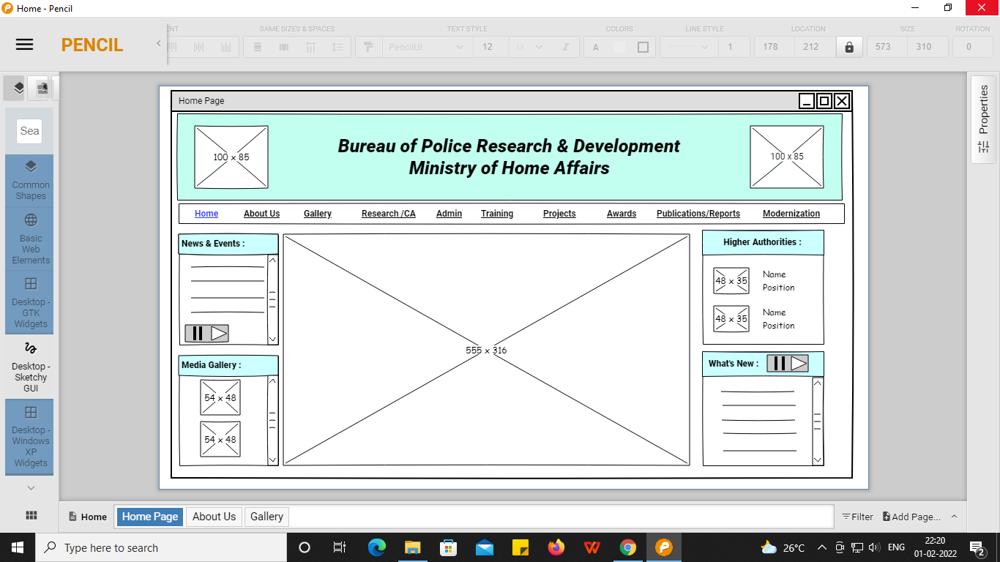
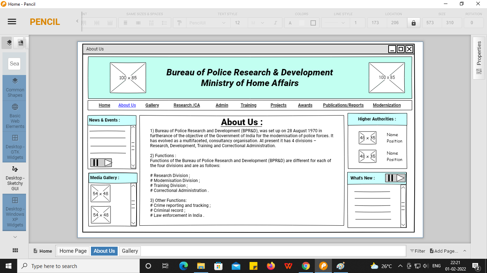
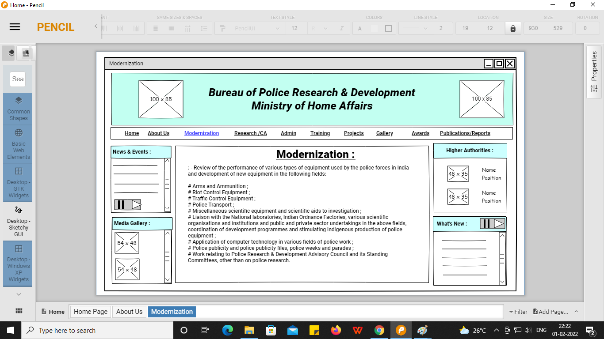

# Wire frame for a website...

## AIM:
To design a wire frame for a website.

## DESIGN STEPS:

### Step 1:
Open a new document and resize the canvas to your required size.

### Step 2:
Use the tools to design the given website.

### Step 3:
Duplicate the layout and modify the next pages.

### Step 4:
Save the documents and export the file as single web page with clickable prototype HTML template.

## OUTPUT:

## Result:
Thus a wire frame is designed for a given website.
